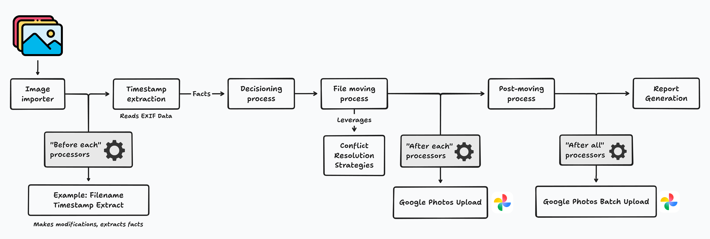
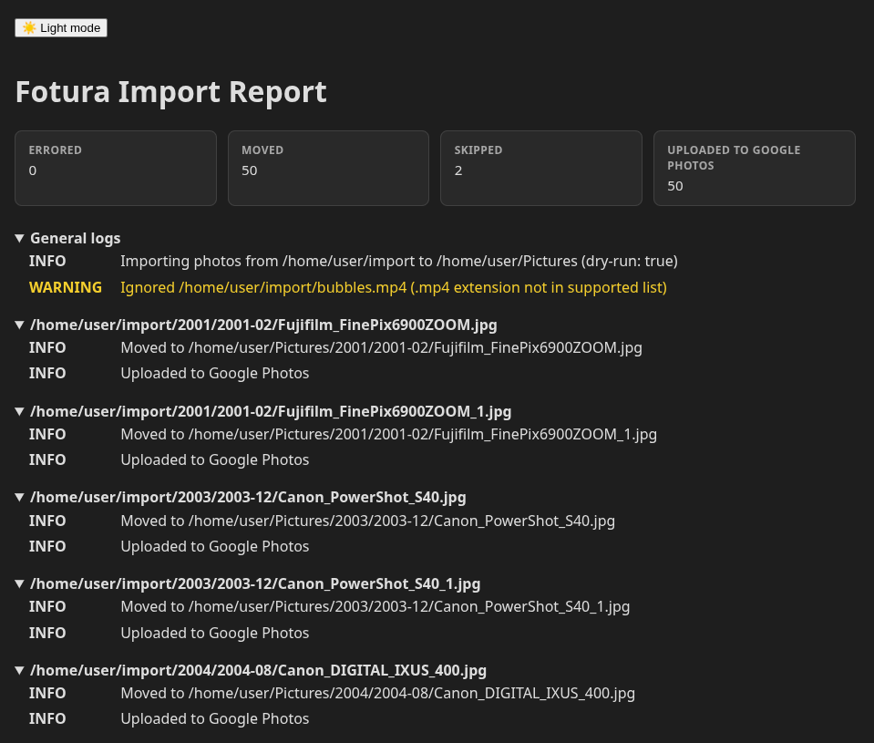

# Fotura


**A Python CLI for importing, organizing, and uploading your photos.**

[](https://github.com/jg23497/fotura/actions/workflows/main.yml)

## Features

- **Automatic photo organization**: Imports photos into a hierarchical directory structure based on their capture timestamps (`%Y/%Y-%m` by default, e.g. `2008/2008-05`).
- **Multiple timestamp extraction methods**:
  - EXIF metadata extraction
  - WhatsApp and Android filename parsing
- **Google Photos uploads**: Upload your photos via the Google Photos API using the extensible processors framework.
- **Dry-run mode**: Preview all changes without moving or modifying your files.
- **Conflict resolution**: Handle filename conflicts using configurable strategies.



## Installation

```
# Install pipx if not already installed
python3 -m pip install --user pipx
python3 -m pipx ensurepath

# Install Fotura
pipx install fotura

# Run Fotura
fotura --help
```

Note, you can also uninstall using `pipx uninstall fotura`.

## Usage

### Basic Usage

```bash
fotura import /photos/to/import /home/user/Pictures
```

### Command Line Options

```bash
fotura import [OPTIONS] DIRECTORY TARGET_ROOT
```

**Arguments:**

- `DIRECTORY`: Source directory containing photos to organize
- `TARGET_ROOT`: Target directory where organized photos will be stored

**Options:**

- `--dry-run`: Show what would be done without making changes
- `--before-each`: List of before-each processors to enable (run for each photo before moving)
- `--after-each`: List of after-each processors to enable (run for each photo after moving)
- `--after-all`: List of after-all processors to enable (run once after all photos are processed)
- `--open-report`: Open the report in a browser once processing completes
- `--conflict-strategy`: How to resolve conflicts in the target directory
- `--target-path-format`: Target path format

### Examples

**Basic photo organization:**

```bash
fotura import ~/Pictures/unsorted ~/Pictures/organized
```

**Dry run to preview changes:**

Always perform a dry run first to ensure your files will be moved as you expect. Fotura will not modify, move, or otherwise touch your files during a dry run.

```bash
fotura import ~/Pictures/unsorted ~/Pictures/organized --dry-run
```

Add `--open-report` to view the report in your web browser:

```bash
fotura import ~/Pictures/unsorted ~/Pictures/organized --dry-run --open-report
```



#### Processors

You can specify multiple processors by repeating the flag, e.g. `--before-each "foo" --before-each "bar"`:

**Enable FilenameTimestampExtract before-each processor:**

```bash
fotura import --before-each "filename_timestamp_extract" ~/Pictures/unsorted ~/Pictures/organized
```

**Enable the Google Photos Upload after-each processor:**

```bash
fotura import --before-each "filename_timestamp_extract" --after-each "google_photos_upload" ~/Pictures/unsorted ~/Pictures/organized
```

**Override the default path format:**

By default, photos are organized into the following structure:

```
target_root/
├── 2023/
│   ├── 2023-01/
│   ├── 2023-02/
│   └── ...
├── 2024/
│   ├── 2024-01/
│   ├── 2024-02/
│   └── ...
└── ...
```

You can override this with `--target-path-format`, which accepts [Python date format codes](https://docs.python.org/3/library/datetime.html#format-codes).

For example, given a photo taken on 2008-05-30, the format `"%Y/%Y-%m/%Y-%m-%d"` produces the path `~/Pictures/organized/2008/2008-05/2008-05-30`:

```bash
fotura import ~/Pictures/unsorted ~/Pictures/organized --dry-run --open-report --target-path-format="%Y/%Y-%m/%Y-%m-%d"
```

_Note: Always perform a dry run first to ensure your photos will be moved as you would expect._

Other common examples:

| Style                     | Format String                 | Example Path                    |
| ------------------------- | ----------------------------- | ------------------------------- |
| **Year / Month**          | `%Y/%m/example.jpg`           | `2008/05/example.jpg`           |
| **Year / Month (named)**  | `%Y/%B/example.jpg`           | `2008/May/example.jpg`          |
| **Year-Month (flat)**     | `%Y-%m/example.jpg`           | `2008-05/example.jpg`           |
| **Month-Day under year**  | `%Y/%m-%d/example.jpg`        | `2008/05-28/example.jpg`        |
| **Day-Month-Year (flat)** | `%d-%m-%Y/example.jpg`        | `28-05-2008/example.jpg`        |
| **Custom folder name**    | `%Y-%m-%d_photos/example.jpg` | `2008-05-28_photos/example.jpg` |

**Select a conflict strategy:**

The `--conflict-strategy` flag determines how to handle filename collisions:

- `keep_both`: Keep both files by appending a numeric suffix to the new file (e.g. `duplicate.jpg` and `duplicate_1.jpg`).
- `skip`: Leave the existing file in place and skip the incoming one. No files are deleted.

Example:

```bash
fotura import ~/Pictures/unsorted ~/Pictures/organized --dry-run --open-report --conflict-strategy 'keep_both'
```

## Before-each Processors

- **FilenameTimestampExtract**: Extracts timestamps from WhatsApp or Android photo filenames and writes them to EXIF metadata (`--before-each "filename_timestamp_extract"`).

## After-each Processors

- **[Google Photos Upload](./docs/processors/google_photos_upload.md)**: Uploads photos to Google Photos, either individually (`--after-each "google_photos_upload"`) or in batches (`--after-all "google_photos_upload_batch"`).

## After-all Processors

After-all processors run once after all photos have been processed. They receive the complete list of processed photos and can perform batch operations.

- **[Google Photos Batch Upload](./docs/processors/google_photos_upload.md)**: Uploads photos to Google Photos using batched API calls (`--after-all "google_photos_upload_batch"`).

  **Parameters:**
  - `concurrency` (int, default: 2): Number of parallel upload threads (1-5)
  - `batch_size` (int, default: 10): Photos per batchCreate API call (1-50)

  **Example:**

  ```bash
  # With default parameters
  fotura import --after-all "google_photos_upload_batch" ~/Pictures/unsorted ~/Pictures/organized
  # With custom parameters
  fotura import --after-all "google_photos_upload_batch:concurrency=3,batch_size=20" ~/Pictures/unsorted ~/Pictures/organized
  ```

  This processor uploads image bytes in parallel using a thread pool, then uses the Google Photos `batchCreate` API to create multiple media items in a single call.

## Future features

- Stripping specific EXIF data (e.g. location data).
- Automatic flagging and skipping of low-quality images, including:
  - blurry shots
  - under or over-exposed images
  - duplicates (picking the best)
- Image labelling via a multimodal LLM, like Llama Vision.

## Development

See [Development](docs/development.md).
