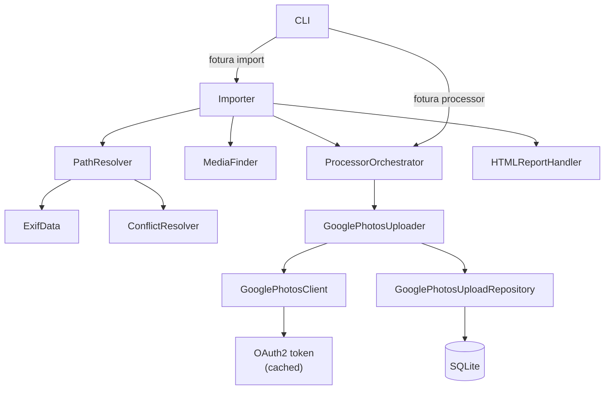
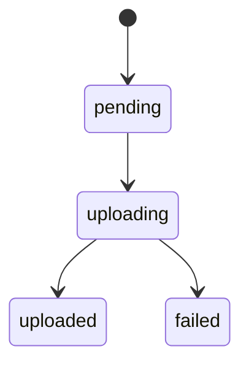

# Development

## Principles

### Compatibility

- The application must be compatible with Linux, MacOS and Windows. Bear this in mind when
  constructing paths in particular, always preferring OS-agnostic approaches.

### Testing

- Test behaviour rather than the implementations, which will also mean
  avoiding an overuse of mocks.

### Architecture

- Design for extensibility so that functionality can be plugged in without requiring significant changes to core
  classes (e.g. see the `conflict_resolution`, `before_each_processors` and `after_each_processors` modules).

### Processing

- Respect the dry run flag. When the dry run flag is enabled, do not modify the filesystem.
- Fail fast. Ensure that failing processes do not continue to run in case of unintended consequences or harm to
  the user's photo library.
- Resumable processors should be idempotent.

## How to

### Setup

Obtain the source code

```
git clone https://github.com/jg23497/fotura.git
cd fotura
```

We use uv for dependency management. To install it:

#### MacOS and Linux (Unix-like systems)

<details>
<summary>Expand instructions</summary>

Install uv using the standalone installer:

```bash
curl -LsSf https://astral.sh/uv/install.sh | sh
```

</details>

#### Windows

<details>
<summary>Expand instructions</summary>

Install uv using one of these methods:

**Option 1: Using PowerShell (recommended)**

```powershell
powershell -c "irm https://astral.sh/uv/install.ps1 | iex"
```

**Option 2: Using pip**

```cmd
pip install uv
```

**Option 3: Using winget**

```cmd
winget install astral-sh.uv
```

</details>

### Run Fotura

Run the following commands:

```bash
# Create a virtual environment
uv venv

# Activate the virtual environment
source .venv/bin/activate # MacOS and Linux
.venv\Scripts\activate # Windows only

# Install the dependencies and package in editable mode
uv pip install -e .
```

This will make the `fotura` command available during development. Next time, you will only need to activate
the virtual environment and run `fotura`.

Alternatively, you can also use `uv run`:

```
uv run src/fotura/main.py
```

### Run tests

A [Makefile](../Makefile) is provided for Unix-like systems. The key targets are:

| Command       | Description          |
| ------------- | -------------------- |
| `make test`   | Run the test suite   |
| `make check`  | Run the linter       |
| `make format` | Format the code      |
| `make type`   | Run type checking    |
| `make ci`     | Run all of the above |

On Windows, refer to the [Makefile](../Makefile) and run the equivalent `uv` commands directly.

### Add development dependencies

```
uv add --dev <name>
```

## Architecture



### The processor pipeline

The core of Fotura is a processor pipeline that runs in three stages for each import:

1. **Before-each processors** run once per photo before it is moved to its target location. They are used to extract facts, which influence how a photo is handled and routed, and can also make modifications to images (e.g. updating incomplete EXIF data).

2. **After-each processors** run once per photo after it has been moved. They are suited to operations that work on individual files in their final location, such as uploading to a remote location.

3. **After-all processors** run once after all photos have been processed. They receive the full list of photos and are suited to operations that benefit from batching, like the Google Photos batch uploader.

ProcessorOrchestrator is responsible for instantiating processors from their registry names them through the import process. Processors that implement the Resumable protocol expose a `resume` method, which lets the CLI re-run failed work without starting a full import over again.

Processors return a Dictionary of FactType objects, which the Importer merges and and accumulates for each Photo object, allowing subsequent processing stages to read them.

Processors can also be invoked independently of an import using `fotura processor run <name> <source>`, which is useful for running or re-running a processor. Resumable processors can be retried using `fotura processor resume <name>`.

### The Google Photos batch upload processor

The `google_photos_upload_batch` after-all processor uploads photos to Google Photos after the full import is complete. Using an after-all processor rather than an after-each processor means all uploads can be issued as batched API calls, which is both more efficient and in line with Google's recommended usage of the Photos Library API.

The processor works in two steps per batch:

1. **Byte upload.** Each photo's raw bytes are uploaded to Google Photos individually, which returns an upload token. This step is parallelised using a ThreadPoolExecutor bounded by a configurable `concurrency` parameter (default: 2, max: 5).

2. **Media item creation.** Once all tokens for a batch are available, a single `batchCreate` call creates up to `batch_size` (default: 10, max: 50) media items in one request.

If individual items within a batch fail at the creation step, the processor retries them one at a time before moving on. The byte upload step itself also retries with exponential backoff before marking an item as failed.

An OperationThrottle is applied to media item creation calls to stay within Google's API rate limits (50 operations per 60 seconds). The throttle uses a sliding window and is thread-safe.

Authentication uses OAuth2 via the Google API client library. On first use, the OAuth flow runs in the browser and the resulting token is cached at `~/.config/fotura/integrations/google_photos/token.json`. On subsequent runs the cached token is loaded and refreshed automatically if expired. The OAuth client secret must be provided separately as `client_secret.json` in the same directory. See the [Google Photos upload processor documentation](processors/google_photos_upload.md) for setup instructions.

Processor parameters are passed on the command line in `name:key=value` format:

```
fotura import ... --after-all-processors google_photos_upload_batch:concurrency=3,batch_size=20
```

### Concurrency

The import pipeline itself is single-threaded. Photos are processed sequentially for the for-each and after-each stages, which allows processing to be immediately halted in case of an exception.

The Google Photos batch processor leverages ThreadPoolExecutor to upload multiple photos concurrently. Multiprocessing is not used.

### SQLite integration

SQLite is used by the Google Photos upload processor. Upload state is persisted in a database at `~/.config/fotura/fotura.db` so that interrupted or partially failed runs can be resumed without re-uploading photos that already succeeded.

Each photo has a row in the `google_photos_uploads` table with a `status` column, which transitions through the following states:



The GooglePhotosUploadRepository wraps all reads and writes to this table. It uses a threading lock to serialise access from concurrent upload threads, and the database itself is opened in Write-Ahead Logging (WAL) mode to allow readers and writers to operate without blocking each other.

When a processor is resumed via `fotura processor resume`, the repository's `find_retryable` method returns all rows in `pending`, `uploading`, or `failed` states, and the processor re-attempts those uploads from scratch. Resumable processors should be idempotent.

The shared Context object provides a Database instance within the processor context, so if additional processors ever need persistence they can easily reuse the existing mechanism.

### CLI interface and modes

The CLI is built with [Click](https://click.palletsprojects.com) and exposes two top-level commands:

- **`fotura import`** is the primary command. It takes a source directory and a target root, discovers photos, runs the full processor pipeline, and generates a report. Processors are specified via `--before-each`, `--after-each`, and `--after-all` options, each accepting one or more processor specs in `name` or `name:key=value` format.

- **`fotura processor`** is a command group for running or resuming processors independently, without triggering a full import. Its subcommands are generated dynamically at startup from the processor registry, so any registered processor automatically gains a `run` and (if Resumable) a `resume` subcommand.

The user config directory is resolved via `platformdirs` so that it follows the platform convention on all supported operating systems (e.g. `~/.config/fotura` on Linux, `~/Library/Application Support/fotura` on MacOS).

### Importer

The Importer class leverages all of the key classes (including MediaFinder, PathResolver, ProcessorOrchestrator and HTMLReportHandler) and orchestrate's Fotura's import process, iterating over discovered photos.

A SynchronizedCounter accumulates statistics (moved, skipped, errored) throughout the run for use in the report summary.

The source and target directories act as a natural queue: a file's presence in the source directory means it has not yet been processed, and its presence in the target directory means it has. This means an interrupted import is inherently resumable — re-running the command will skip files that have already been moved and pick up where it left off.

### MediaFinder

MediaFinder discovers photo files in the source directory tree using a recursive glob. Results are yielded in sorted order so that processing is deterministic regardless of filesystem ordering.

Supported extensions are defined in a module-level `SUPPORTED_EXTENSIONS` constant.

### Path resolution

PathResolver determines where each photo should be placed in the target directory tree. It combines the photo's capture date with the configured `--target-path-format` string (a Python `strftime` format, defaulting to `%Y/%Y-%m`) to build the target directory, then appends the original filename.

Before returning a path, it checks for conflicts against both the filesystem and a `claimed_paths` set that tracks paths already assigned in the current run. If a conflict is found, it delegates to the configured conflict resolution strategy. Photos with no resolvable date are skipped.

### Conflict resolution

Conflict resolution is implemented as a strategy pattern. Two strategies are provided:

- **keep_both** appends an incrementing counter to the filename stem until a unique name is found (e.g. `photo_1.jpg`, `photo_2.jpg`).
- **skip** returns `None` to skip the conflicting file entirely.

New strategies can be added by implementing the StrategyBase interface and registering them in the conflict resolution registry.

### Report generation

At the end of each import run, an HTML report is written to the platform data directory (e.g. `~/.local/share/fotura/reports/` on Linux). The report is generated by a custom logging handler, HTMLReportHandler, which collects log records emitted during the run and groups them by photo. At close time it renders them via a Jinja2 template alongside a summary of the import statistics.
